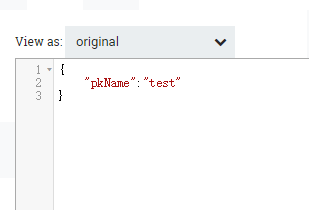
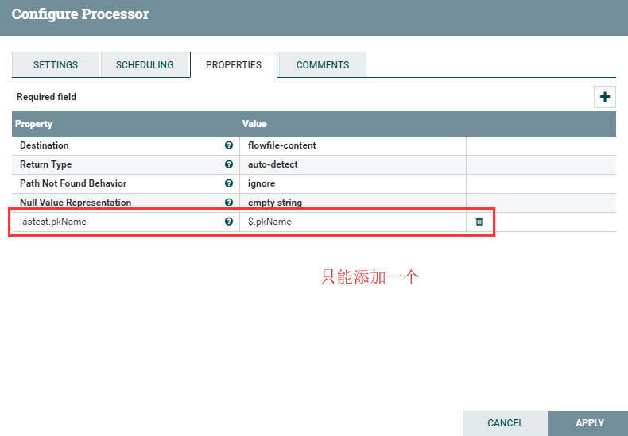
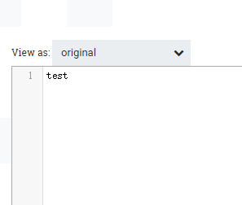

# EvaluateJsonPath
***
编辑人(全网同名)：__**酷酷的诚**__  邮箱：**zhangchengk@foxmail.com** 
***

## 描述

该处理器根据流文件的内容计算一个或多个JsonPath表达式。这些表达式的结果被写入到FlowFile属性，或者写入到FlowFile本身的内容中，这取决于处理器的配置。通过添加用户自定义的属性来输入jsonpath，添加的属性的名称映射到输出流中的属性名称(如果目标是flowfile-attribute;否则，属性名将被忽略)。属性的值必须是有效的JsonPath表达式。“auto-detect”的返回类型将根据配置的目标进行确定。当“Destination”被设置为“flowfile-attribute”时，将使用“scalar”的返回类型。当“Destination”被设置为“flowfile-content”时，将使用“JSON”返回类型。如果JsonPath计算为JSON数组或JSON对象，并且返回类型设置为“scalar”，则流文件将不进行修改，并将路由到失败。如果所提供的JsonPath计算为指定的值，JSON的返回类型可以返回“scalar”。如果目标是“flowfile-content”，并且JsonPath没有计算到一个已定义的路径，那么流文件将被路由到“unmatched”，无需修改其内容。如果目标是“flowfile-attribute”，而表达式不匹配任何内容，那么将使用空字符串创建属性作为值，并且FlowFile将始终被路由到“matched”。

## 属性配置

在下面的列表中，必需属性的名称以粗体显示。任何其他属性(不是粗体)都被认为是可选的，并且指出属性默认值（如果有默认值），以及属性是否支持表达式语言。

|属性名称|默认值|可选值|描述|
|----|----|----|----|
|**Destination**|flowfile-content|▪flowfile-content  ▪flowfile-content|指示是否将JsonPath计算结果写入流文件内容或流文件属性;如果使用flowfile-attribute，则必须指定属性名称属性。如果设置为flowfile-content，则只能指定一个JsonPath，并且忽略属性名。|
|**Return Type**|auto-detect|▪auto-detect  ▪json  ▪scalar|指示JSON路径表达式的期望返回类型。选择“auto-detect”，“flowfile-content”的返回类型自动设置为“json”，“flowfile-attribute”的返回类型自动设置为“scalar”。|
|**Path Not Found Behavior**|ignore|▪warn  ▪ignore|指示在将Destination设置为“flowfile-attribute”时如何处理丢失的JSON路径表达式。当没有找到JSON路径表达式时，选择“warn”将生成一个警告。|
|**Null Value Representation**|empty string|▪empty string  ▪empty string|指示产生空值的JSON路径表达式的所需表示形式。|

## 动态属性：

该处理器允许用户指定属性的名称和值。

|属性名称|属性值|描述|
|----|----|----|
|用户自由定义的属性名称|用户自由定义的属性值|在该处理器生成的文件流上添加用户自定义的属性。如果使用表达式语言，则每批生成的流文件只执行一次计算 . 支持表达式语言:true(只使用变量注册表进行计算)|

## 连接关系

|名称|描述|
|----|----|
|failure|当不能根据流文件的内容计算JsonPath时，流文件被路由到这个关系;例如，如果流文件不是有效的JSON|
|unmatched|当JsonPath不匹配流文件的内容，并且目标被设置为流文件内容时，流文件被路由到这个关系|
|matched|当成功地计算了JsonPath并修改了流文件后，流文件将被路由到这个关系|

## 读取属性

没有指定。

## 写属性

没有指定。

## 状态管理

此组件不存储状态。

## 限制

此组件不受限制。

## 输入要求

此组件需要传入关系。

## 系统资源方面的考虑

没有指定。

## 应用场景

通常当需要从流文件json中提取某些数据作为流属性时，使用此处理器；或者从流文件json内容中提取一部分内容作为下一个流文件内容，使用此处理器。

## 示例说明

流程模板xml(1.9.2)

<a href="../template/EvaluateJsonPath.xml" download="EvaluateJsonPath.xml">EvaluateJsonPath.xml</a>

1：提取流文件json内容，作为输出流的属性。（注意：当输出选择flowfile-attribute时，及时jsonpath匹配不到值，流文件也会路由到matched）

输入json如下：

输出结果如下：

2：提取流文件json内容，作为输出流的内容。（注意：当选择flowfile-content时，用户只能自定义添加一个属性；如果jsonPath匹配不到，会路由到unmatched）

输出流内容：

## 公众号

关注公众号 得到第一手文章/文档更新推送。

