# GenerateTableFetch
***
编辑人(全网同名)：__**酷酷的诚**__  邮箱：**zhangchengk@foxmail.com** 
***

## 描述   

该处理器用于生成在表中执行分页查询的SQL 查询语句，分区(属性partition)大小以及表的行数决定页面的大小和数量以及生成的流文件。此外，可以通过设置最大值列来实现增量抓取数据，处理器会跟踪列的最大值，从而只抓取列值超过已记录到的最大值的行，该处理器只在主节点上运行，可以接受传入的连接;

提供传入连接与否，处理器的行为是不同的:

如果没有指定传入连接，处理器将根据指定的处理器调度生成SQL语句。许多字段都支持表达式语言，但是没有流文件属性可用。但是，可以使用变量注册表评估属性。

如果指定了传入连接，并且处理器任务没有可用的流文件，则不执行任何工作。

如果指定了传入连接，并且处理程序任务有可用流文件，则流文件的属性可以在表达式语言中用于表名等字段。但是，Max-Value列和返回字段的列必须为空或者引用每个指定表中可用的列(多表查询，字段也可以设置成属性表达式语言就可以了)。

## 属性配置

在下面的列表中，必需属性的名称以粗体显示。任何其他属性(不是粗体)都被认为是可选的，并且指出属性默认值（如果有默认值），以及属性是否支持表达式语言。

属性名称                                      | 默认值       | 可选值                                                                                                                                    | 描述                                                                                                                                                                                                                                                                                                                   
----------------------------------------- | --------- | -------------------------------------------------------------------------------------------------------------------------------------- | ---------------------------------------------------------------------------------------------------------------------------------------------------------------------------------------------------------------------------------------------------------------------------------------------------------------------
**Database Connection Pooling Service**   |           | **Controller Service API:**   BCPService    **Implementations:**    DBCPConnectionPool   DBCPConnectionPoolLookup     HiveConnectionPool | 用于获取到数据库的连接的控制器服务。                                                                                                                                                                                                                                                                                                   
**Database Type**                         | Generic   |▪Generic  ▪Oracle  ▪Oracle 12+   ▪MS SQL 2012+   ▪MS SQL 2008  ▪MySQL                                                              | 数据库的类型，用于生成特定于数据库的代码。在许多情况下，泛型类型就足够了，但是有些数据库(如Oracle)需要定制SQL子句。                                                                                                                                                                                                                                                      
**Table Name**                            |           |                                                                                                                                        | 要查询的数据库表的名称。 **支持表达式语言:true(将使用流文件属性和变量注册表进行评估)**                                                                                                                                                                                                                                                                   
Columns to Return                         |           |                                                                                                                                        | 要在查询中使用的以逗号分隔的列名列表。如果数据库需要对名称进行特殊处理(例如引用)，那么每个名称都应该包含这样的处理。如果没有提供列名，则返回指定表中的所有列。注意:对于给定的表，使用一致的列名很重要，这样增量获取才能正常工作。 **支持表达式语言:true(将使用流文件属性和变量注册表进行评估)**                                                                                                                                                             
Maximum-value Columns                     |           |                                                                                                                                        | 以逗号分隔的列名列表。处理器将跟踪处理器开始运行以来返回的每个列的最大值。使用多个列意味着要对列列表进行排序，并且每个列的值的增长速度都比前一列的值要慢。因此，使用多个列意味着列的层次结构，**通常用于分区表。**此处理器仅可用于检索自上次检索以来已添加或更新的行。注意，一些JDBC类型(如bit/boolean)不利于维护最大值，因此这些类型的列不应该列在此属性中，并且在处理过程中会导致错误。如果没有提供此列，则将考虑表中的所有行，这可能会影响性能。注意:对于给定的表，使用一致的max-value列名很重要，这样增量获取才能正常工作。 **支持表达式语言:true(将使用流文件属性和变量注册表进行评估)**
**Max Wait Time**                         | 0 seconds |                                                                                                                                        | 允许运行SQL select查询的最大时间量，为零意味着没有限制。小于1秒的最长时间等于零。 **支持表达式语言:true(将使用流文件属性和变量注册表进行评估)**                                                                                                                                                                                                                                 
**Partition Size**                        | 10000     |                                                                                                                                        | 每个生成的SQL语句要获取的结果行数。表中总行数除以分区大小给出生成的SQL语句(即流文件)的数量。值为0表示将生成一个流文件，其SQL语句将获取表中的所有行。 **支持表达式语言:true(将使用流文件属性和变量注册表进行评估)**                                                                                                                                                                                               
Column for Value Partitioning             |           |                                                                                                                                        | 值将用于分区的列的名称。默认行为是使用结果集中的行号，使用偏移或限制策略将结果分区到要从数据库获取的“页面”中。然而，对于某些数据库，在适当的情况下使用列值本身来定义“页面”可能更有效(比如自增ID)。只有当默认查询执行得不好、没有最大值列或只有一个最大值列（其类型可以强制为长整数（即不是日期或时间戳））且列值均匀分布而不是稀疏时，才应使用此属性 **支持表达式语言:true(将使用流文件属性和变量注册表进行评估)**                                                                                                 
Additional WHERE clause                   |           |                                                                                                                                        | 在构建SQL查询时，要在WHERE条件中添加一个自定义子句。 **支持表达式语言:true(将使用流文件属性和变量注册表进行评估)**                                                                                                                                                                                                                                                 
**Output Empty FlowFile on Zero Results** | false     | ▪true  ▪false                                                                                                                         | 根据指定的属性，此处理器的执行可能不会生成任何SQL语句。当此属性为真时，将生成一个空流文件(如果存在传入流文件的父文件)，并将其传输到success关系。当此属性为false时，将不会生成任何输出流文件。                                                                                                                                                                                                              

## 动态属性

该处理器允许用户指定属性的名称和值。

属性名称                                | 属性值       | 描述                                                                                                                                        
----------------------------------- | --------- | ------------------------------------------------------------------------------------------------------------------------------------------
initial.maxvalue.<max_value_column> | 指定列的初始最大值 | 属性应该以“initial.maxvalue.<max_value_column>”格式添加。此值仅在第一次访问表时使用(指定最大值列时)。在传入连接的情况下，仅第一次为流文件中指定的每个表使用该值。 **支持表达式语言:true(将使用流文件属性和变量注册表进行评估)**

## 连接关系

名称      | 描述                                                               
------- | -----------------------------------------------------------------
sucess  | 成功地从SQL查询结果集创建了流文件。                                              
failure | 此关系仅在SQL查询执行失败(使用传入流文件)时才使用。传入的流文件将被惩罚并路由到此关系。如果没有指定传入连接，则此关系不使用。

## 读取属性

没有指定。

## 写属性

属性名称                              | 描述                                                                       
--------------------------------- | -------------------------------------------------------------------------
generatetablefetch.sql.error      | 如果处理器有传入连接，并且处理传入流文件会导致SQL异常，则将流文件路由到failure，并将此属性设置为异常消息。               
generatetablefetch.tableName      | 要查询的数据库表的名称。                                                             
generatetablefetch.columnNames    | 查询中使用的以逗号分隔的列名列表。                                                        
generatetablefetch.whereClause    | 查询中用于获取预期行的Where子句。                                                      
generatetablefetch.maxColumnNames | 逗号分隔的列名列表，用于跟踪处理器开始运行以来返回的数据。                                            
generatetablefetch.limit          | SQL语句要获取的结果行数。                                                           
generatetablefetch.offset         | 用于检索相应分区的偏移量。                                                            
fragment.identifier               | 从相同的查询结果集生成的所有流文件对于片段都具有相同的值。标识符属性。然后可以用它来关联结果。                          
fragment.count                    | 这是单个ResultSet生成的流文件的总数。这可以与片段一起使用。标识符属性，以便知道有多少流文件属于相同的传入结果集。            
fragment.index                    | 这是这个流文件在所有由相同执行生成的输出流文件列表中的位置。这可以与片段一起使用。标识符属性，以了解哪些流文件源自相同的执行，以及生成流文件的顺序

## 状态管理

范围      | 描述                                                                                                    
------- | ------------------------------------------------------------------------------------------------------
CLUSTER | 在对指定表执行查询之后，将保留指定列的最大值，以便在将来执行查询时使用。这允许处理器只获取最大值大于保留值的记录。这可以用于增量抓取，抓取新添加的行，等等。要清除最大值，请根据状态管理文档清除处理器的状态

## 限制

此组件不受限制。

## 输入要求

此组件允许传入连接关系。

## 系统资源方面的考虑

没有指定。

## 应用场景

GenerateTableFetch使用其属性和指定的数据库连接生成包含SQL语句的流文件，这些SQL语句可用于从表中获取分页的数据。GenerateTableFetch执行对数据库的查询，以确定当前行数和最大值，如果指定了最大值列，则收集其最大值列的值大于GenerateTableFetch最后观察到的值的行数。这允许增量获取新行，而不是每次生成SQL来获取整个表。如果没有设置最大值列，那么处理器将生成SQL来每次获取整个表。

为了生成将获取分页数据的SQL，默认情况下GenerateTableFetch将生成基于最大值列(如果存在)对数据排序的SQL，并使用结果集的行号来确定每个页面。例如，如果最大值列是一个整数“id”，分区大小为10，那么第一个页面的SQL可能是“SELECT * FROM myTable LIMIT 10”，第二个页面可能是“SELECT * FROM myTable OFFSET 10 LIMIT 10”，依此类推。

根据数据库、行数等，对数据进行排序可能是一项昂贵的操作。或者，也可以使用column for Value Partitioning属性指定一个列，该列的值将用于确定页面。如果设置了，GenerateTableFetch将确定列的最小值和最大值，并使用最小值作为初始偏移量。然后，获取页面的SQL基于这个初始偏移量和值的总差(即最大值-最小值)除以页面大小。例如,如果列“id”用于值分区,然后列值100到200,页面大小为10的SQL来获取第一页可能是“SELECT * FROM myTable id > = 100和id < 110”和第二页可能是“SELECT *从myTable id > = 110和id < 120”,等等。

重要的是，将用于值分区的列设置为可以强制类型为长整数(即不是日期或时间戳)的列，并且为了获得最佳性能，列值是均匀分布的，而不是稀疏的。作为上面的反例，考虑一个列“id”，其值分别为100、2000和30000。如果分区大小为100，那么列值相对稀疏，因此“第二页”(参见上面的示例)的SQL将返回零行，直到查询中的值变为“id >= 2000”为止，每个页面都将返回零行。另一个反例是值不是均匀分布的：假设一个值为100、200、201、202、…299. 然后，第一个页面的SQL(参见上面的示例)将返回值为id = 100的一行，第二个页面将返回值为200的100行……299. 这可能导致下游处理时间不一致，因为页面可能包含非常不同的行数。由于这些原因，建议使用足够密集(而不是稀疏)且分布相当均匀的列进行值分区。

## 示例说明：(示例中表数据都很少，所以一般都生成了一条流数据，)

首先配置好数据库DBCPConnectionPool：

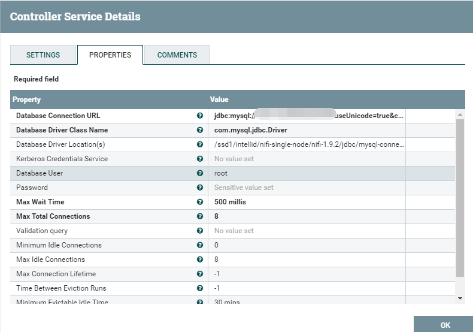

然后配置GenerateTableFetch中的Database Connection Pooling Service：

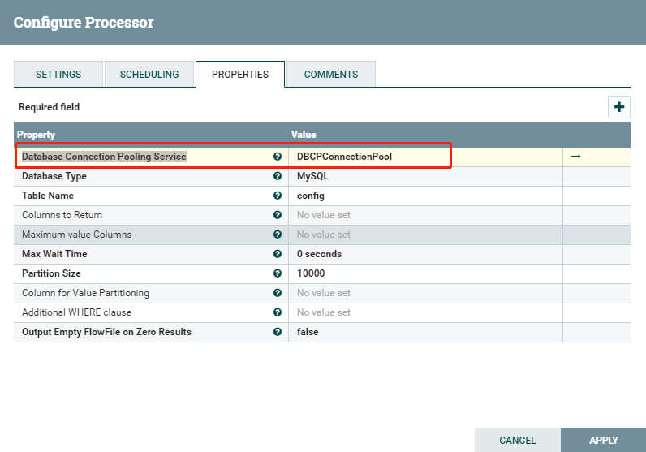

案例一：无输入流文件，来源表含增量字段

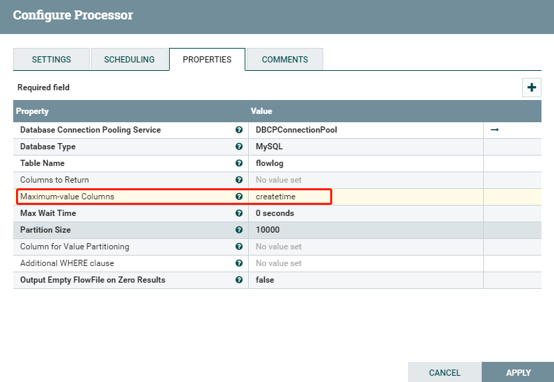
输出SQL语句：

保存状态：

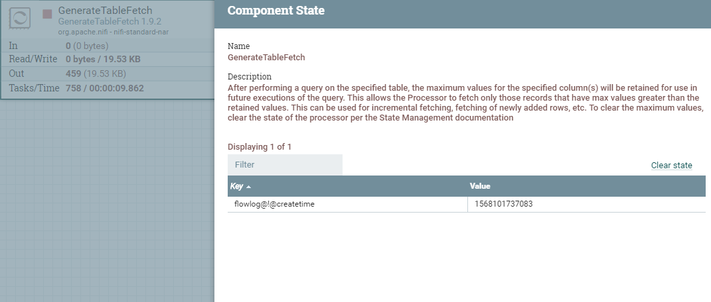

案例二：无输入流文件，不含增量字段

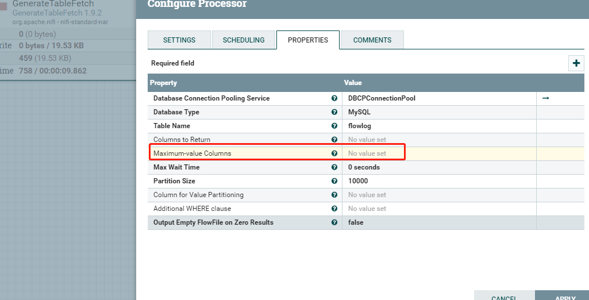

输出：

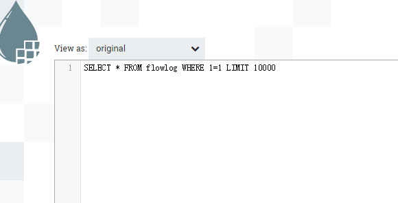

案例三：无输入流文件，带自增id

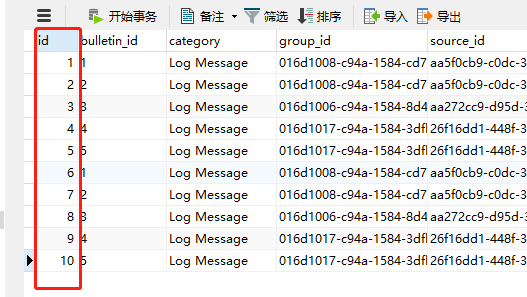

当然，实际增量抽取时，max-value也设置成id

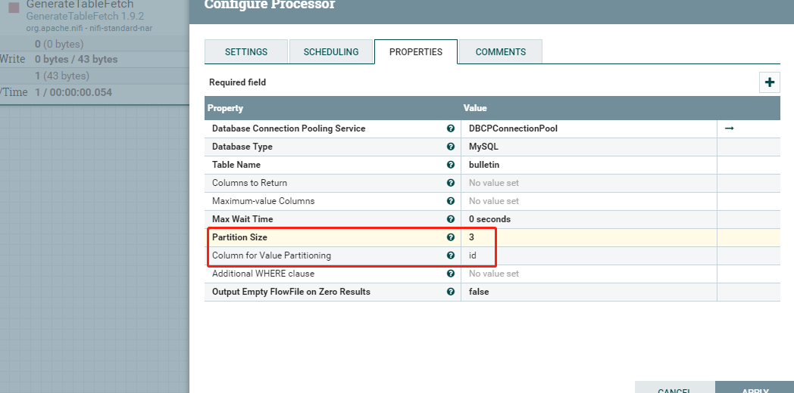

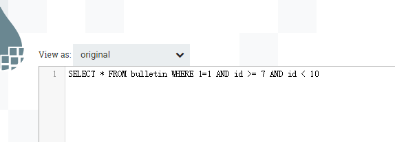

案例四：有来源流文件，查多表,无增量字段

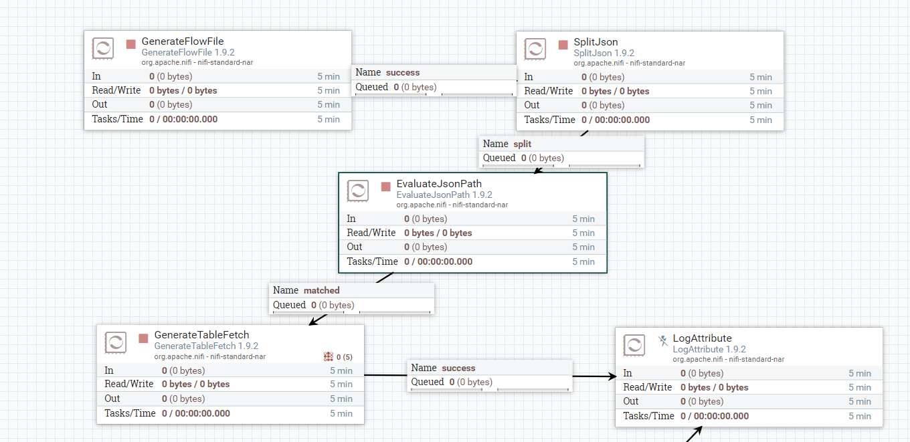

使用GenerateFlowFile配置一个多表表名数组，切割json，然后将表名提取到属性中：

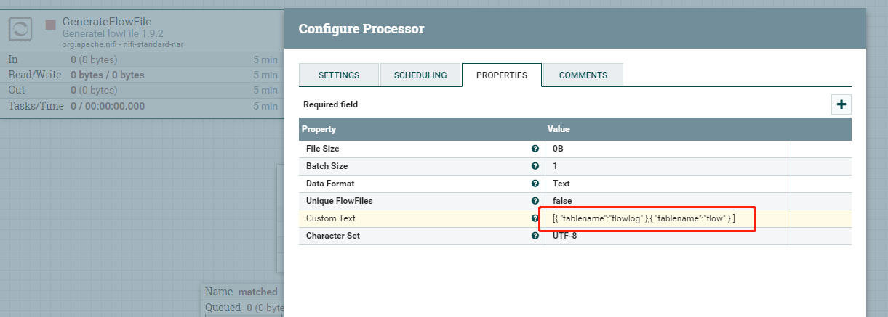

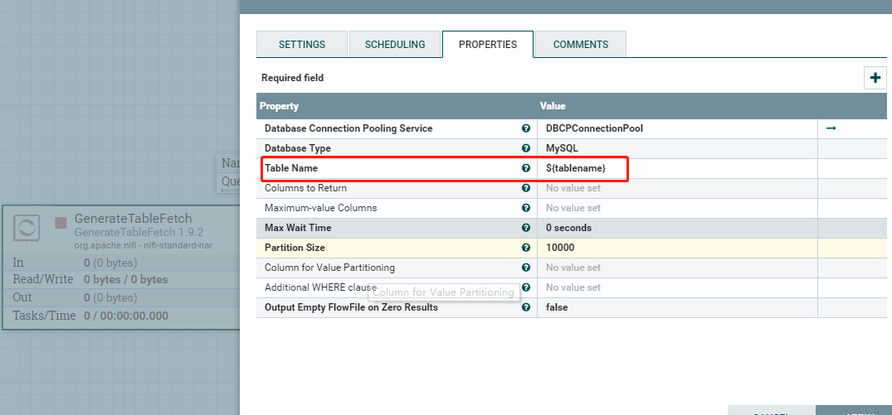

输出结果：

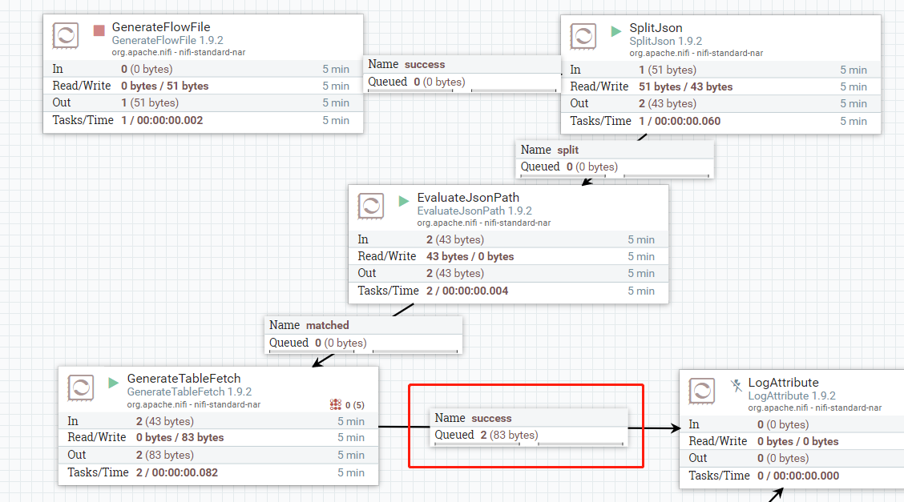

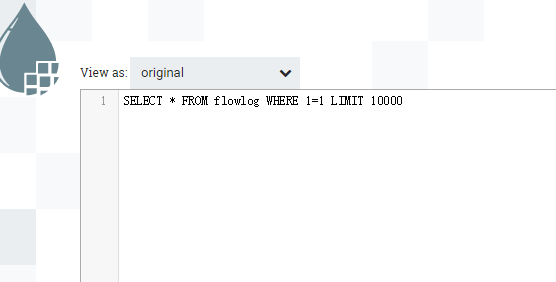

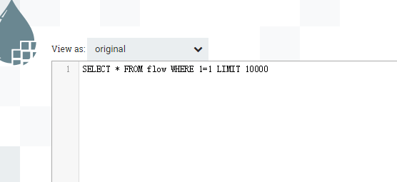

案例五：有来源流文件，查多表,带增量字段

只将案例四中json修改一下：

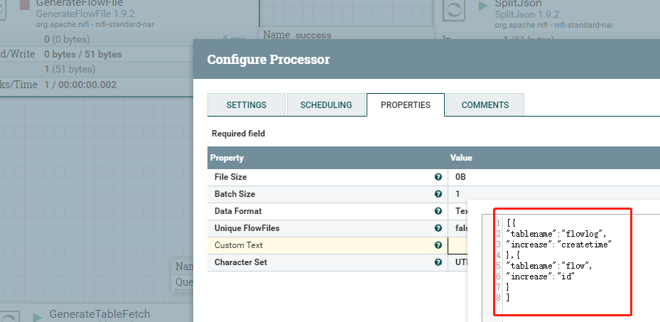

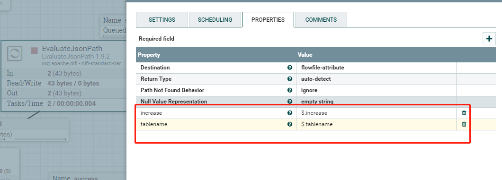

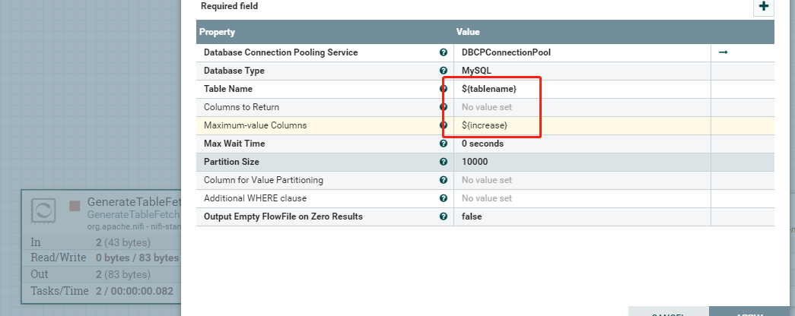

输出结果：

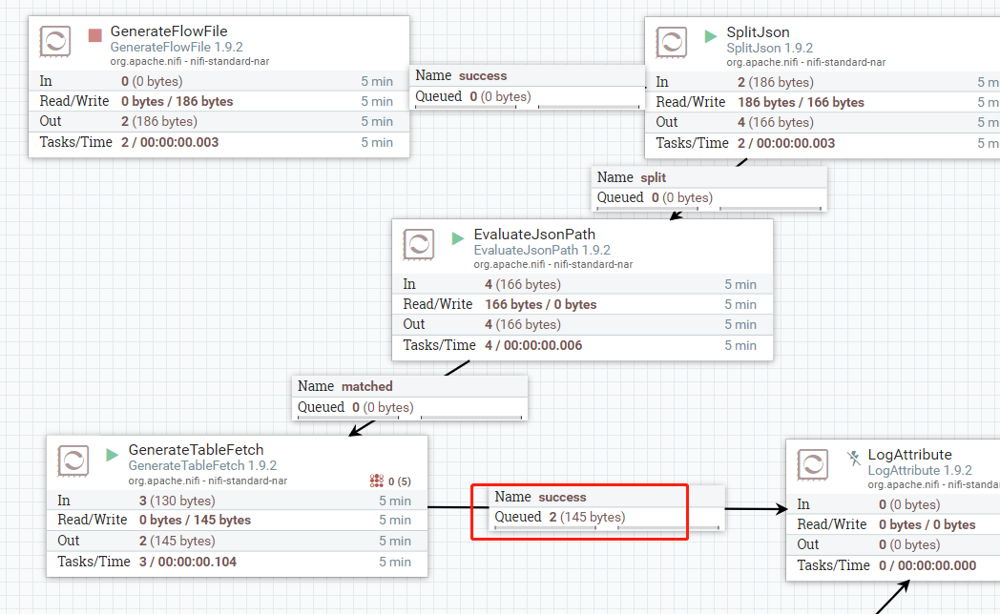

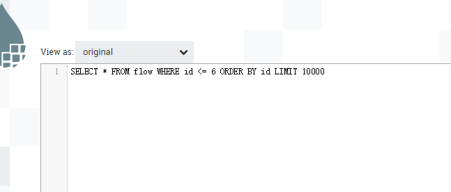

状态：

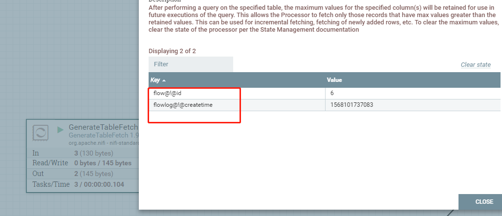

## 公众号

关注公众号 得到第一手文章/文档更新推送。

