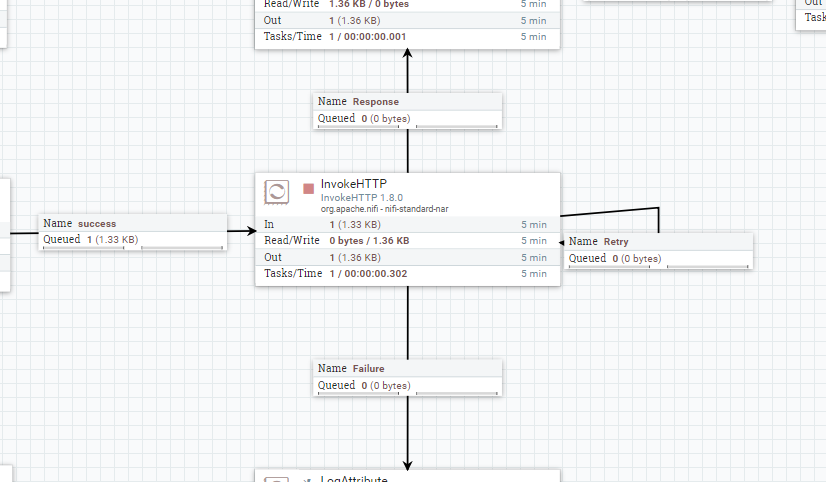
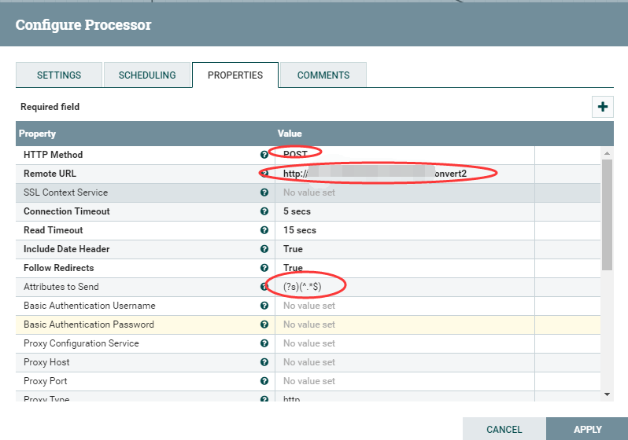
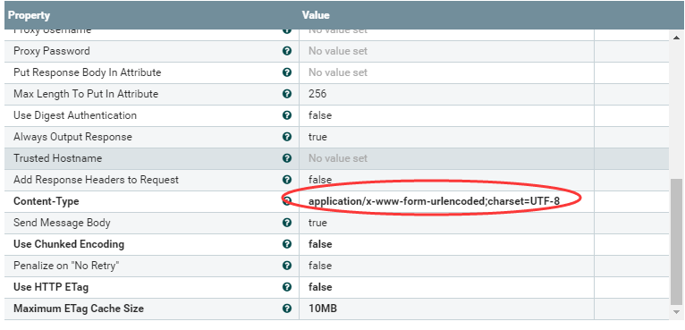
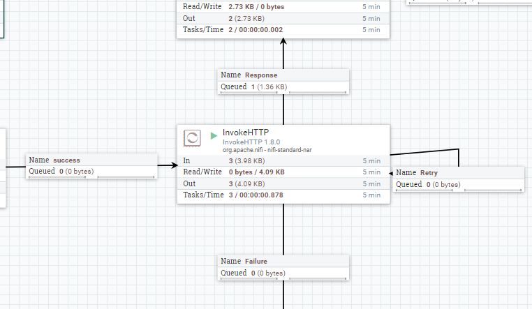
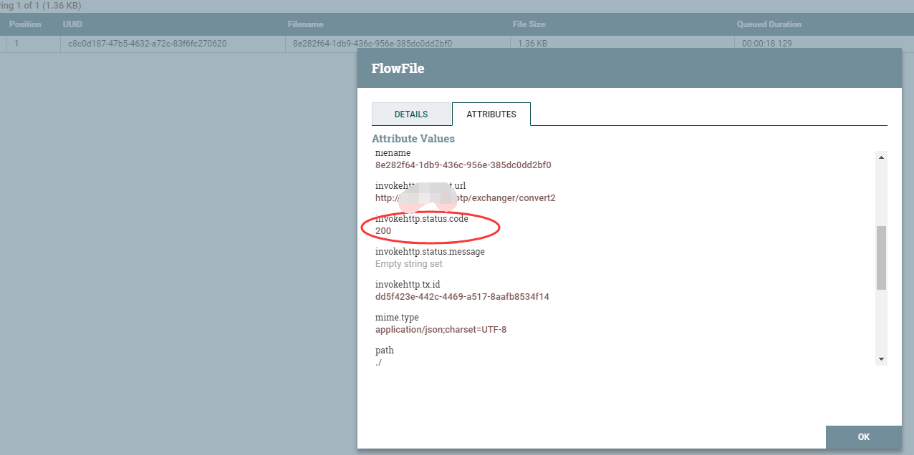

# InvokeHTTP
***
编辑人(全网同名)：__**酷酷的诚**__  邮箱：**zhangchengk@foxmail.com** 
***

## 描述

该处理器用于执行HTTP请求。目标URL和HTTP方法是可配置的。流文件属性可以被转换为HTTP头文件，流文件内容被包含为请求的主体(前提如果使用HTTP  PUT、POST或PATCH方法)。

## 属性配置

在下面的列表中，必需属性的名称以粗体显示。任何其他属性(不是粗体)都被认为是可选的，并且指出属性默认值（如果有默认值），以及属性是否支持表达式语言。除此之外，还可以指出属性值是否敏感，

如果是敏感数据则配置在nifi.properties 文件的 nifi.sensitive.props.key.

属性名称                            |     默认值      | 可选值                                                                                                                                       | 描述                                                                                                                                       
------------------------------- |---------------:| ----------------------------------------------------------------------------------------------------------------------------------------- | -----------------------------------------------------------------------------------------------------------------------------------------
**HTTP Method**                 |     GET      |                                                                                                                                           | HTTP请求方法(GET、POST、PUT、PATCH、DELETE、HEAD、OPTIONS)。除了POST、PUT和PATCH之外的方法将在没有消息体的情况下发送。 支持表达式语言:true                                       
**Remote URL**                  |              |                                                                                                                                           | 将连接到的远程URL，包括协议、IP、端口、路径。                                                                                                                
SSL Context Service             |              | **Controller Service API:** SSLContextService **Implementations:** StandardRestrictedSSLContextService StandardSSLContextService | SSL上下文服务，为TLS/SSL (https)连接提供客户端证书信息，还用于连接到HTTPS代理。                                                                                      
**Connection Timeout**          |    5 secs    |                                                                                                                                           | 连接到远程服务的最大等待时间。                                                                                                                          
**Read Timeout**                |   15 secs    |                                                                                                                                           | 远程服务响应的最大等待时间。                                                                                                                           
**Include Date Header**         |     True     | ▪True  ▪False                                                                                                                            | 请求中是否包含一个RFC-2616日期头。                                                                                                                    
**Follow Redirects**            |     True     |▪True  ▪False                                                                                                                            | 是否遵循远程服务器发出的HTTP重定向。                                                                                                                     
Attributes to Send              |              |                                                                                                                                           | 正则表达式，它定义在请求中哪些属性作为HTTP头发送。如果没有定义，则不会将属性作为HTTP头发送。此外，任何用户自定义的动态属性都将作为HTTP请求头发送。                                                          
Basic Authentication Username   |              |                                                                                                                                           | 客户端用于远程URL进行身份验证的用户名。不能包含控制字符(0-31)、':'或DEL(127)。                                                                                        
Basic Authentication Password   |              |                                                                                                                                           | 客户端用于远程URL进行身份验证的密码。 **Sensitive Property: true**                                                                                       
Proxy Configuration Service     |              | **Controller Service API:** ProxyConfigurationService **Implementation:** StandardProxyConfigurationService                     | 代理控制器服务。如果设置，它将取代该处理器配置的代理设置。支持的代理有:SOCKS, HTTP + AuthN                                                                                  
Proxy Host                      |              |                                                                                                                                           | 代理服务器的主机名或IP地址 支持表达式语言:true                                                                                                             
Proxy Port                      |              |                                                                                                                                           | 代理服务器的端口 支持表达式语言:true                                                                                                                   
Proxy Type                      |     http     |                                                                                                                                           | 代理类型。必须是http或者https 支持表达式语言:true                                                                                                        
Proxy Username                  |              |                                                                                                                                           | 针对代理进行身份验证时的用户名 支持表达式语言:true                                                                                                            
Proxy Password                  |              |                                                                                                                                           | 针对代理进行身份验证时的密码 支持表达式语言:true **Sensitive Property: true**                                                                               
Put Response Body In Attribute  |              |                                                                                                                                           | 如果设置了，返回的响应体将被放入原始流文件的属性中，而不是单独的流文件。要放入的属性键由该属性的值决定。 支持表达式语言:true                                                                       
Max Length To Put In Attribute  |     256      |                                                                                                                                           | 如果将响应体路由到原始属性(即设置了“Put response body in attribute”属性)，则向属性值中放入的字符最多为这个数量。这一点很重要，因为属性保存在内存中，而较大的属性将很快导致内存不足。如果输出比这个值长，则将其截断。如果可能的话，考虑将其缩小。
Use Digest Authentication       |    false     | ▪true  ▪false                                                                                                                            | 是否使用摘要身份验证与网站通信。“Basic Authentication Username”和“Basic Authentication Password”用于认证。                                                     
Always Output Response          |    false     | ▪true  ▪false                                                                                                                            | 不管接收到的服务器状态代码是什么，将强制生成响应流文件并将其路由到“响应”关系中                                                                                                 
Trusted Hostname                |              |                                                                                                                                           | 绕过普通的信任存储库主机名验证程序，以允许指定的远程主机名为可信主机。启用此属性具有MITM安全含义，请明智地使用。仍然接受基于普通信任库主机名验证器的其他连接。仅对SSL (HTTPS)连接有效。                                      
Add Response Headers to Request |    false     | ▪true  ▪ false                                                                                                                            | 启用此属性可将所有响应标头保存到原始请求中。                                                                                                                   
**Content-Type**                | ${mime.type} |                                                                                                                                           | 指定通过PUT、POST或PATCH传输的内容类型。在对表达式语言表达式求值后出现空值的情况下，Content-Type默认为application/octe -stream                                                  
Send Message Body               |     true     | ▪ true  ▪false                                                                                                                            | 如果为true，则在POST/PUT/PATCH请求上发送HTTP消息体(默认)。如果为false，则为这些请求禁用消息体和内容类型头部。                                                                    
**Use Chunked Encoding**        |    false     | ▪true  ▪false                                                                                                                            | 传送内容时将此属性设置为true，目的是不传递content-length，而是发送'Transfer-Encoding'，其值为'chunked'。这将使HTTP 1.1中引入的数据传输机制能够以块的形式传递未知长度的数据。                        
Penalize on "No Retry"          |    false     | ▪true  ▪false                                                                                                                            | 启用此属性将惩罚路由到“No Retry”关系的流文件。                                                                                                             
**Use HTTP ETag**               |    false     | ▪true  ▪false                                                                                                                            | 支持HTTP请求的HTTP实体标记(ETag)。                                                                                                                 
**Maximum ETag Cache Size**     |     10MB     |                                                                                                                                           | 允许ETag缓存增长到的最大大小。默认大小为10MB。                                                                                                              

## 动态属性：

该处理器允许用户指定属性的名称和值。

|属性名称|属性值|描述|
|----|----|----|
|用户自由定义的属性名称(Header Name)|用户自由定义的属性值(Attribute Expression Language)|发送带有动态属性的键和通过计算动态属性值中的属性表达式语言集创建的值的请求头。 支持表达式语言:true(只使用变量注册表进行计算)|

## 连接关系

名称       | 描述                                                                                 
-------- | -----------------------------------------------------------------------------------
Original | 成功后将路由原始流文件(2xx状态码)。                                                               
Failure  | 原始流文件在任何类型的连接失败、超时或一般异常时路由到此。                                                      
Retry    | 原始流文件将被路由到任何可以重试的状态码(5xx状态码)上。                                                     
No Retry | 原始流文件将被路由到任何不应该重试的状态代码(1xx、3xx、4xx状态代码)上。                                          
Response | 响应流文件将在成功时路由(2xx状态码)。如果“Output Response Regardless”属性为true，则无论接收到什么状态代码，响应都将发送到该关系。

## 读取属性

没有指定。

## 写属性

Name                              | Description                                                               
--------------------------------- | --------------------------------------------------------------------------
invokehttp.status.code            | 返回的状态代码                                                                   
invokehttp.status.message         | 返回的状态消息                                                                   
invokehttp.response.body          | 在接收到的状态代码不成功的实例中(2xx)，则响应主体将放在“invokehttp.response”中。请求流文件的主体属性。          
invokehttp.request.url            | 请求URL                                                                     
invokehttp.tx.id                  | 读取响应后返回的事务ID                                                              
invokehttp.remote.dn              | 当处理器故障转移到远程服务器时，将引发Java异常类的DN                                             
invokehttp.java.exception.class   | 当处理器失败时引发Java异常类                                                          
invokehttp.java.exception.message | 当处理器失败时，会引发Java异常消息                                                       
user-defined                      | 如果设置了'Put Response Body In Attribute'属性，那么无论它被设置为什么，都将成为属性键，其值将是HTTP响应的主体。

## 状态管理

此组件不存储状态。

## 限制

此组件不受限制。

## 输入要求

此组件允许传入连接关系。

## 系统资源方面的考虑

没有指定。

## 应用场景

该处理器比较强大，可以嵌入到实际业务场景中，针对某一个业务数据处理服务，该处理器可以去获取数据或者发送数据。

## 示例说明

1：列举最常见的post请求

将流文件中的属性都作为http头请求发送

## 公众号

关注公众号 得到第一手文章/文档更新推送。

