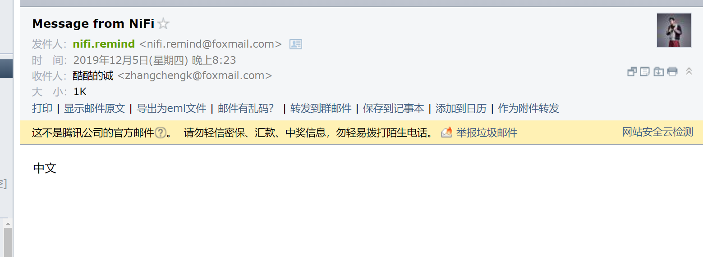

# PutEmail
***
编辑人(全网同名)：__**酷酷的诚**__  邮箱：**zhangchengk@foxmail.com** 
***

## 描述 

该处理器从流文件中提取内容，发送邮件。

## 属性配置

在下面的列表中，必需属性的名称以粗体显示。任何其他属性(不是粗体)都被认为是可选的，并且指出属性默认值（如果有默认值），以及属性是否支持表达式语言。

属性名称                                  |              默认值               | 可选值            | 描述                                                    
------------------------------------- |---------------------------------:| -------------- | ------------------------------------------------------
**SMTP Hostname**                     |                                |                | SMTP host **支持表达式语言:true**                          
**SMTP Port**                         |               25               |                | SMTP Port **支持表达式语言:true**                         
SMTP Username                         |                                |                | SMTP Username **支持表达式语言:true**                     
SMTP Password                         |                                |                | SMTP Password **敏感: true**  **支持表达式语言:true**      
**SMTP Auth**                         |              true              |                | 指示是否应该使用身份验证的标志 **支持表达式语言:true**                    
**SMTP TLS**                          |             false              |                | 指示是否应该启用TLS的标志 **支持表达式语言:true**                        
**SMTP Socket Factory**               | javax.net.ssl.SSLSocketFactory |                | SMTP Socket Factory   **支持表达式语言:true**                
**SMTP X-Mailer Header**              |              NiFi              |                | 发送邮件header中的X-Mailer **支持表达式语言:true**               
Attributes to Send as Headers (Regex) |                                |                | 正则表达式，流文件中的属性作为headers发送邮件                            
**Content Type**                      |           text/plain           |                | Mime Type 比如text/plain 、 text/html  **支持表达式语言:true** 
**From**                              |                                |                | 指定用作发件人的电子邮件地址。逗号分隔的地址序列遵循RFC822语法。 **支持表达式语言:true**
To                                    |                                |                | 指定收件人的电子邮件地址。逗号分隔的地址序列遵循RFC822语法。   **支持表达式语言:true**  
CC                                    |                                |                | 指定抄送人的电子邮件地址。逗号分隔的地址序列遵循RFC822语法。   **支持表达式语言:true**  
BCC                                   |                                |                | 指定暗抄送的电子邮件地址。逗号分隔的地址序列遵循RFC822语法。   **支持表达式语言:true**  
**Subject**                           |       Message from NiFi        |                | 邮件主题   **支持表达式语言:true**                               
Message                               |                                |                | 邮件信息   **支持表达式语言:true**                               
**Flow file content as message**      |             false              |                | 是否将流文件内容作为邮件信息发送，如果选是，则忽略Message配置   **支持表达式语言:true** 
**Attach File**                       |             false              | true false | 指定FlowFile内容是否应该附加到电子邮件中                              
**Include All Attributes In Message** |             false              | true false | 指定是否应该在电子邮件的正文中记录所有的FlowFile属性                        

## 连接关系  

名称      | 描述         
------- | -----------
success | 成功发送邮件得流文件 
failure | 未成功发送邮件得流文件

## 读取属性

没有指定。

## 写属性

没有指定。

## 状态管理

此组件不存储状态。

## 限制

此组件不受限制。

## 输入要求

此组件需要传入连接关系。

## 系统资源方面的考虑

没有指定。

## 应用场景

该处理器很简单，就是发送邮件

## 示例说明

1：以QQ SMTP为例，怎么开通QQ邮箱SMTP请自行查询

配置好必须项，需要注意的是，中文信息邮件的Content-type要加上UTF-8

最后成功收到邮件:

## 公众号

关注公众号 得到第一手文章/文档更新推送。

