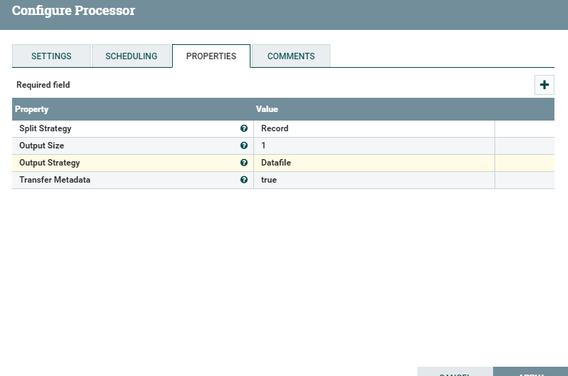
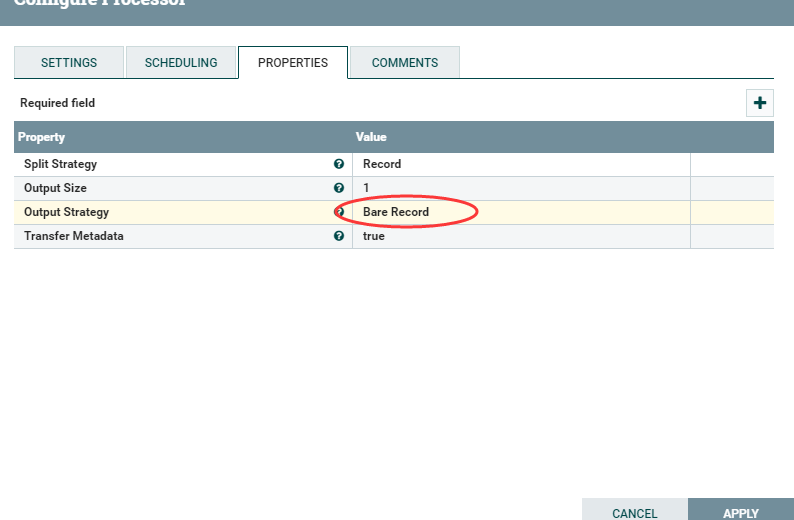

# SplitAvro
***
编辑人(全网同名)：__**酷酷的诚**__  邮箱：**zhangchengk@foxmail.com** 
***

## 描述

该处理器根据配置将二进制编码的Avro数据文件分割成更小的文件。输出策略决定split后的文件是Avro数据文件，还是只保留Avro记录(在FlowFile属性中包含元数据信息 )。输出总是二进制编码的。

## 属性配置

在下面的列表中，必需属性的名称以粗体显示。任何其他属性(不是粗体)都被认为是可选的，并且指出属性默认值（如果有默认值），以及属性是否支持表达式语言。

|属性名称|默认值|可选值|描述|
|----|----|----|----|
|Split Strategy|Record|▪Record|分解传入数据文件的策略。Record策略将通过反序列化每个记录来读取传入的数据文件。|
|Output Size|1||每个分割文件包含的Avro记录的数量。在传入文件的记录小于输出大小的情况下，或者当记录的总数不均匀地除以输出大小时，可以得到少于Output Size数的分割文件。|
|Output Strategy|Datafile|▪Datafile  ▪Bare Record|确定数据输出的格式。要么是Avro数据，要么是Bare Record（不含元数据信息及字段信息）。Bare Record仅用于已知该数据的系统，不具有通用性。|
|Transfer Metadata|true|▪true  ▪false|是否将元数据从父数据流传输到子数流。如果输出策略是Bare Record，则元数据将存储为FlowFile属性，否则将存储在数据文件头中。|

## 连接关系

|名称|描述|
|----|----|
|failure|如果一个流文件因为某种原因无法处理(例如，流文件不是有效的Avro)，它将被路由到这个关系|
|original|被分割的原始流文件。如果流文件处理失败，则不会向该关系发送任何内容|
|split|所有从原始流文件中分离出来的新文件都将被路由到这个关系|

## 读取属性

没有指定。

## 写属性

|名称|描述|
|----|----|
|fragment.identifier|从同一个父流文件生成的所有分割流文件都将为该属性添加相同的UUID(随机生成)|
|fragment.index|一个增长的数字，表示从单个父流文件创建的分割流文件的顺序|
|fragment.count|从父流文件生成的分割流文件的数量|   
|segment.original.filename|父流文件的文件名|

## 状态管理

此组件不存储状态。

## 限制

此组件不受限制。

## 输入要求

此组件需要传入关系。

## 系统资源方面的考虑

|资源|描述|
|----|----|
|内存|此组件的实例可能会导致系统资源的大量使用。多个实例或高并发性设置可能导致性能下降。|

## 应用场景

用于切分较大的 avro文件。

## 示例说明

此组件的split功能与[SplitJson](./SplitJson)大体相似，可以参考它的[示例](./SplitJson#示例说明)，这里主要通过实例看一下Datafile 和Bare Record 的区别，

1：Output Strategy 设置为DataFile

结果为：

2：Output Strategy 设置为Bare Record

结果为

