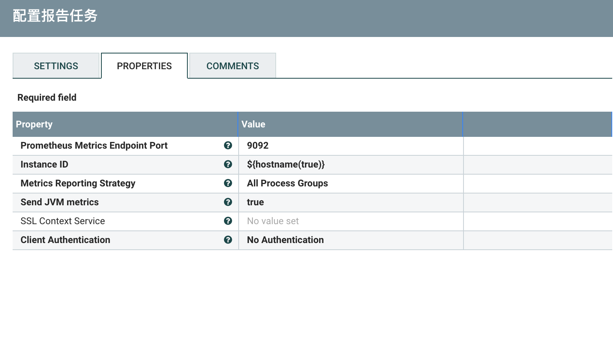
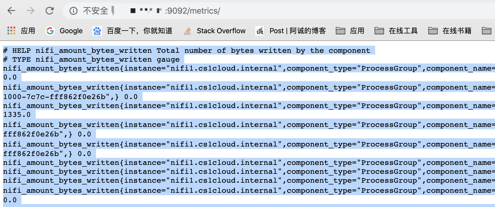
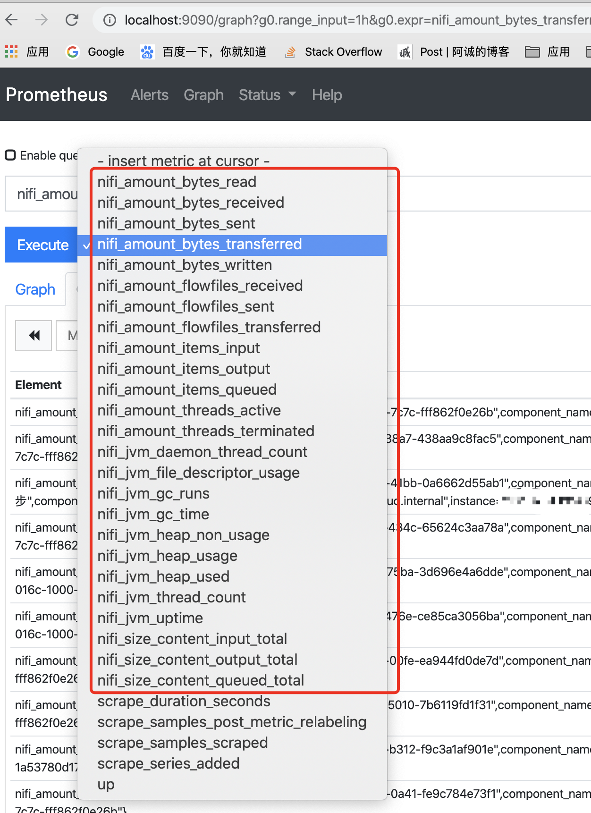

# PrometheusReportingTask
***
编辑人(全网同名)：__**酷酷的诚**__  邮箱：**zhangchengk@foxmail.com** 
***

## 描述

 该任务处理器通过创建metrics(http)端点来报告Prometheus格式的指标数据，该端点可用于应用程序的外部监控。ReportingTask报告一组关于JVM(可选)和NiFi实例的指标数据。

## 属性配置

在下面的列表中，必需属性的名称以粗体显示。任何其他属性(不是粗体)都被认为是可选的，并且指出属性默认值（如果有默认值），以及属性是否支持表达式语言。(1.11.4版本)

|属性名称|默认值|可选值|描述|
|----|----|----|----|
|Prometheus Metrics Endpoint Port|9092||端点的端口(Prometheus会到这个端口拉数据) 支持表达式语言:true|
|Instance ID|${hostname(true)}||该NIFI实例被Prometheus采集数据的ID标识|
|Metrics Reporting Strategy|All Components|Root Process Group All Process Groups All Components |报告metrics的粒度，只包含这三个选项 |
|Send JVM metrics|false|true false|除了NiFi指标外，是否还要发送JVM指标|
|SSL Context Service||Controller Service API: RestrictedSSLContextService Implementation:  StandardRestrictedSSLContextService|如果设置了，端点只会接收HTTPS请求，否则就是默认的HTTP请求|
|Client Authentication|No Authentication|No Authentication Want Authentication Need Authentication |指定报告任务是否应该对客户端进行身份验证。如果未指定\<SSL Context Service\>属性，或者提供的SSL仅使用KeyStore而不使用TrustStore，则忽略此值。|

## 状态管理

此组件不存储状态。

## 限制

无。

## 系统资源方面的考虑

无

## 应用场景

首先很高兴的是,NIFI在1.10版本中添加了普罗米修斯的监控,这个组件就是给普罗米修斯收集一些NIFI的指标数据(可选jvm的一些指标)，使用起来很简单。

## 示例说明

配置示例：

直接Get 9092/metrics/

在普罗米修斯中查看

